# Chap 2: Instructions: Language of the Computer

# Instructions

### Instruction set(IS)

幾種常見的 IS : 

- MIPS: Stanford 做的
- RISC-V: UC Berkeley 做的，是 open source 的，讓 user 可以自由運用。目前由 RISC-V foundation 維護[1]。非營利，跨國。中國現在比較積極用這個。 (V 是羅馬數字 5)。大宗做在 embedded system，例如印表機，因為比較不會有不相容的問題。

 

### ISA 中的算術運算

```jsx
add a, b, c      // a gets b+c
```

 

```c
f = (g + h) - (i + j)
```

經過 compiler 後， RISC-V  code就是:

```c
add t0,g,h //tempt0=g+h 
add t1,i,j //tempt1=i+j 
sub f,t0,t1 //f=t0-t1
```

temp 可能放在 memory 裡面暫存。

---

# Data Operands

## Register Operands (RISC-V)

register file 像是衣服上的口袋

`register` : 暫存器，處理機能夠使用的最快的空間。

RISC-V has a 32 × 64-bit register file

MIPS has a 32 × 32-bit register file

可以放常用的資料

compiler 會自己判斷哪些是最常用的

可以幫 register 命名：常見的是數字編號，但也可以有別名，例如:

`$t0, $t1, ..., $t9`: for temporary values

`$s0, $s1, ..., $s7`: for saved variables

### Example

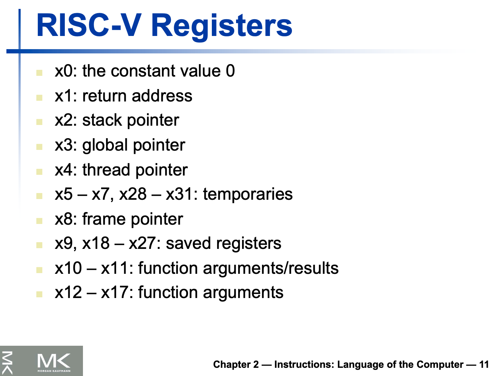

"0" 很常用

所有的編譯器會照著這些規則做。 不用背。每個 ISA 都可以定義自己的一套 register 。

所以剛剛的 code 會變成

把 f.....j 放在 x19, x20, .....x23

暫存結果放在 x5, x6：

```c
add x5,x20,x32 //tempt0=g+h 
add x6,x22,x23 //tempt1=i+j 
sub x19,x5,x6 //f=t0-t1
```

sub 在前面兩行執行完之後才可以執行。

## Memory Operands

假如 register 放不下了，就會放到 memory 裡面。

memory → register : load

register → memory: store

**memory address**: 單位是 byte ，把 memory 想成一個很大的陣列，第一個 8-bit 是第一個address單位

### Big-Endian v.s  Little-Endian[2]

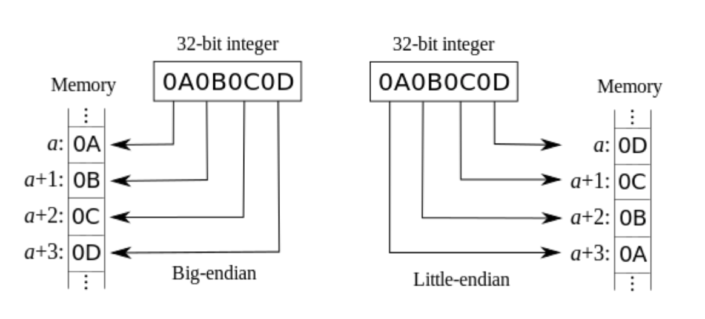

例子：

```c
A[12] = h + A[8]
```

1. `h` 放在 register 的 x21 
2. 要先知道 A 的起始位置在哪： base address = x22
3. A[8] 跟 A[0] 差 8 個單位，而每單位是 8 bytes，故 A[8] 是從 A[0] 開始 64 byte 的地方。→ A[0] = 64(x22), A[12] = 96(x22)

則 RISC-V code:

```c
ld   x9, 64(x22)
add  x9, x21, x9
sd   x9, 96(x22) 
```

`ld`: load

`sd` : store

## Immediate Operands

```c
addi x22, x22, 1  //x22 = x22 + 1
```

因為加上一個常數很常出現

例如做 for loop 時，i++

這樣就不用再從 mem load 進來

**常見指令**

MIPS: register 0 叫做 `$zero` 就是存 constant 0。

RISC-V: `x0`

應用：

```c
add $t2, $t1, $zero  //把 t1 搬到 t2
```

## 數字的 representation

用最左邊，最高的 bit 代表正負號

假如需要負數，那正數的 range 就會砍半，用來表示負數

 0: 0000 0000 ... 0000

 –1: 1111 1111 ... 1111 

Most-negative: 1000 0000 ... 0000

Most-positive: 0111 1111 ... 1111

### 補數 complement

把 1 變 0, 0 變 1

ex: 要把 2 變 -2

1. 先取補數
2. 再加 1 

```c
n +2 = 0000 0000 ... 0010
n –2 = 1111 1111 ... 1101 +1 = 1111 1111 ... 1110
```

### 8-bit to 16-bit

把 sign bit 決定前面要補什麼

```c
+2: 0000 0010 => 0000 0000 0000 0010
–2: 1111 1110 => 1111 1111 1111 1110
```

### 16進位


# R-format/I-format/S-format Instructions

## R-format

（是在某些原則下找出的solution）

共通都會有的元素：

- operation code: 定義這是哪個類型的 operation。會優先看這個，知道要幹嘛
- destination register number: 存放運算結果。
- source register number: 存要用來運算的參數。
- function code: 儲存運算類型(ex: add, sub...)

為什麼不增加多一點 register? 為什麼維持 32 個？

1. 規格都定好了，再改會影響到很多其他的
2. 多一點不一定比較快

### RISC-V

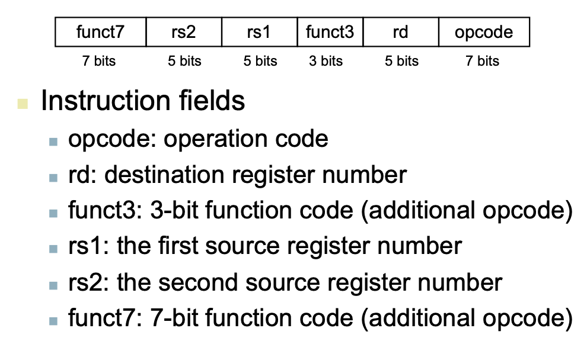

從右向左讀。

### MIPS

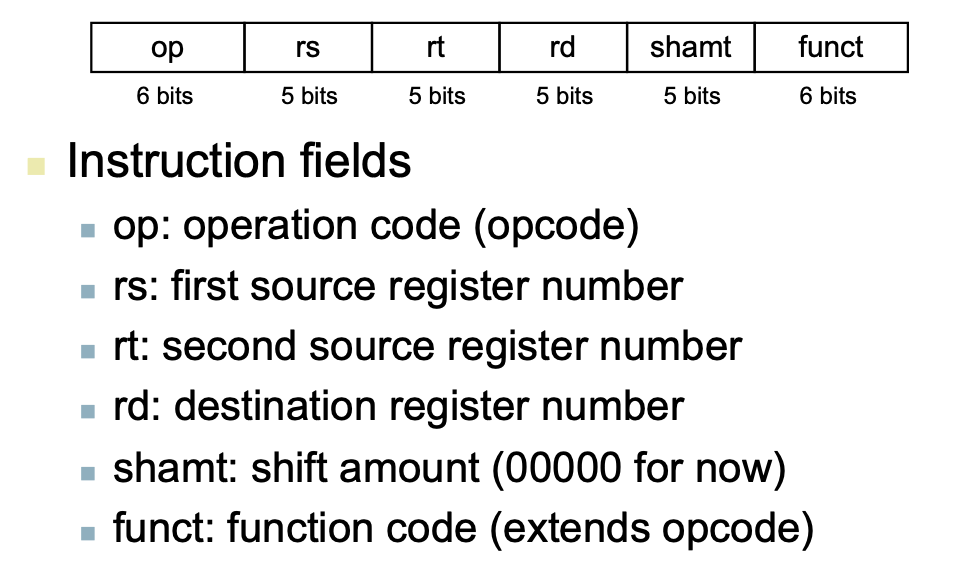

從左向右讀。

特有的是 shamt: shift amount

### 以 RISC-V版本作為Example

假設指令為

```c
add x9, x20, x21
```


1. 已知 rd = x9=01001(轉成二進制), rs1=x20=10100

    rs2=x21=10101

    opcode=add

2. 查 green card 得知 add 這個 opcode 是 0110011
3. 沒有用到額外的 function code，所以 funct7 跟 funct3 都是 0。（填滿 bit 數）
4. 把整串二進制轉成 16 進制，得到 `015A04B3` 。

## I-format

為了紀錄 [Immediate operand](https://www.notion.so/Instructions-Language-of-the-Computer-9a144e23d2494ba4936b36f22ca398ba#2ccbecb513b4441e802471c60683de7e) 要用的。

### RISC-V

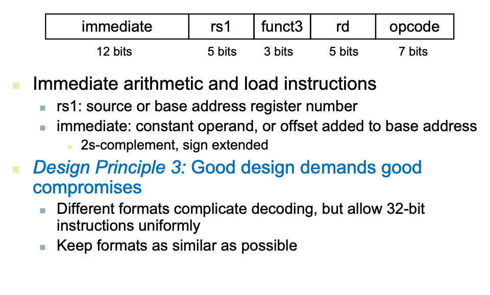

### MIPS


## S-format

要拿來執行 `store` operation。 [review] store 代表 data from register to memory。[3]

沒有 `rd` ，因為 store 不需要把結果寫到 register，所以不需要。

會有兩個 source：

1. 放起始 register 位置
2. 放 address

共有 5+7 個 immediate bits，兩者串起來代表一個數字（12 bits）

[]()

# Logical Operations 邏輯運算指令(記！）


### Shift

空出來的欄位補零

`slli` : shift left logical immediate

shift 一格 = 乘以 2， shift n 格= $2^n$ 倍

 

`srli` :

shift 一格 = 除以 2， shift n 格=除以 $2^n$ 倍。原來的位置就是餘數。

### AND

Set: 設成1

clear: 變成 0

像是一個 mask

### XOR

只能有一個 1 ，結果才會是 1。（兩個 input 一定要不同，才會 output 1)

(0,1)

- NOT:

    又叫作 inverter，會把 0 變成 1，1變成0

    用 XOR 實現 NOT:

[]()

# Conditional Operations

```c
beq re1, rs2, L1
```

`beq` : branch equal

如果 re1 == rs2, 就去做 L1 instruction

`bne` : branch not equal

### Example 1： if

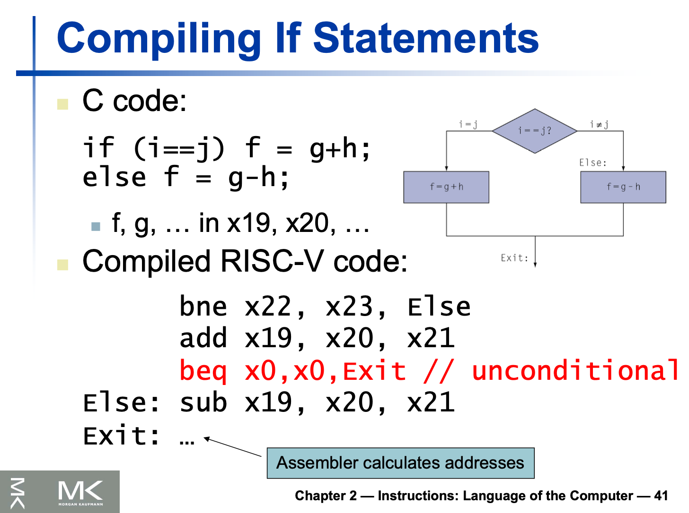

假如照順序往下做，那做完 if 裡面的 add 就會繼續做 ELSE 裡面的內容，因此一定要加上 `beq x0, x0, Exit` 直接跳到結束。

### Example 2： loop


之所以要 shit 3, 是因為 save[i]存的東西需要 3個 bits，所以 save[i+1] 比 save[i] 要再往左 3 個 bits。

```c
slli x10, x22, 3     //從 x22 往左移 3 個 bits, 結果存到 x10
add  x10, x10, x25   // 把 address 的起點再加上 x10(相對位移),再存回 x10 (絕對位移） 
ld    x9, 0(x10)     // 把 0(x10) 的內容 load 到 x9
bne   x9, x24, Exit  // 如果 x9 != x24, 跳到 Exit
addi x22, x22, 1     // i += 1
beq   x0,  x0, Loop  // 繼續進行 Loop
```

### Basic Blocks

一個 basic block 的起點通常是 label, 結束通常是一個 branch

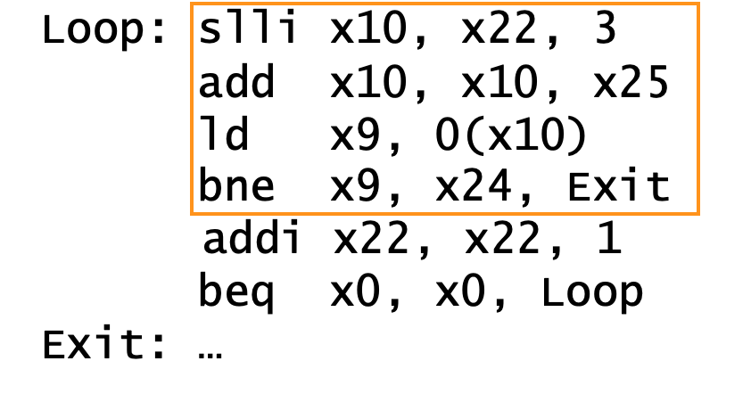

如果 compiler 能夠識別出 basic blocks, 就可以做優化。

## 其他 Conditional Ops

blt

bge

### MIPS Design

## Example

# Procedure Calling

參數傳遞的方法，跳耀的細節

1. 把參數放在 x10 ~ x17 的暫存 register （假如需要傳遞的參數長度大於 8 個，可能可以先擺在其他地方，not common case）
2. 跳到 procedure 開頭
3. request 工作區域 `storage` 給 local variable
4. 開始做 Ops
5. 把結果存在 register，等待 caller
6. 傳回去呼叫的地方（當初會把呼叫者的位置資訊存在 x1）

## 需要用到的 instructions

- Procedure call

```c
jal x1, ProcedureLabel
```

`jal` : jump and link

`x1` : 紀錄 jump 之前的位置

`ProcedureLabel` : 目的地位置

- Procedure return

```c
jalr x0, 0(x1)
```

跟 jal 的差別是會跳回 `0 + x1存的位置`

可以實現 computed jumps , ex: C 語言中的 case/switch statements

### Example: leaf procedure

主程式：主幹

分支：leaf（不會再呼叫其他func）


f 是 local variable，需要有位置暫存， g, h, i, j是外面傳進來的。

把 f 存在 x20

計算 g+h, i+j 時，會產生一些暫時的output, 存在 x5, x6

可是 x20, x5, x6 在上一層 parent 程式可能有先存東西...

那就先把這些東西先找個地方存起來，清空來用。 

就像去租房子，覺得房東給的櫃子很爛，那就先把櫃子移去別的地方放著，買自己的櫃子。等到要退租的時候，帶走自己的櫃子，還原房東的櫃子，還給他。

`sp` : 永遠指向 top of stack。


前面有 sd, 後面有 ld，是 overhead，要盡可能減少這類的操作

直接定義 x5, x6, x20 都是 temp 的 register，那在用之前就不需要保存它。

### Non-Leaf Procedures

因為有可能再呼叫別人，參數可能會被改，也還要傳回去 parent

所以要記錄的有

1. 要傳回去哪裡
2. 把有用到而且可能被 children 用的參數存下來


不要濫用 recursive, 會overhead, 會佔用大量的 memory

recursive v.s loop ，有時候 loop 比較快

C++ : pointer 很重要，用來 access dynamic data

程式執行的時候，會有一個  program counter （PC）, 指向目前所執行的程式所在位置。當執行到 beq (要跳到別的 branch)時，會改變 program counter ，讓他指向目標 branch所在位置。

# Synchronization

多核心，會共享 memory，要如何避免衝突

ex: P1 write, P2 read

要確定 P1 write 的動作已經完成。

每個 processor 有自己的一套 register。

atomic swap of register

### Example

x+=1 : 把 x 提出來， 加一，再存回去

```c
// Load reserved
lr.d rd, (rs1) 
//把 rs1 的東西 load 到 rd，並且預留 rs1 的位置

//store conditional
sc.d rd, (rs1), rs2
/*
succeed
fail: 在執行過程中有人去動到 rs1。重做一次
*/
```

```c
lr.d x10,(x20)      // 把 x20 load 到 x10
sc.d x11,(x20),x23  // 把 x23 寫進 x20，x11 紀錄成功與否
bne x11,x0,again    // if falied, 重新嘗試
addi x23,x10,0      // X23 = loaded value
```

### spin lock

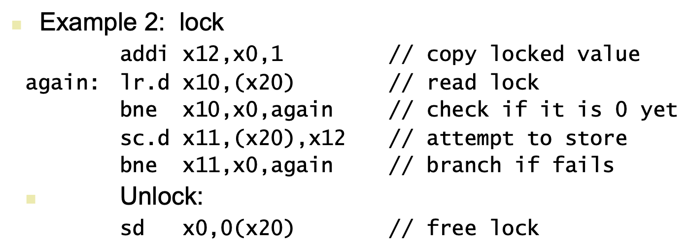

大家都在門口等待，同時間只有一個人能拿到 key

# Translation and Startup

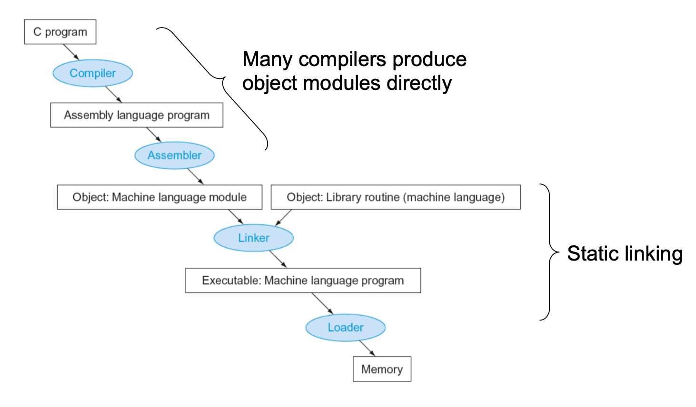

`header` : 索引，哪個東西放在 module 的哪裡

`Text segment` : 那些轉換後的 machine code。之後會被放進 memory 的 "text" 區裡面

`Static data segment` :  整個 program 都會用到的 global data。之後會被放進 memory 的 " static data" 區裡面。

`Relocation info`: 做連結的時候要用到

`Symbol table`: 給人看，做連結

`Debug info` : 放一些 debug 說明給麻瓜看

## Linking Object Modules

有兩個 module 要連結起來

把 text 等各種區域合併

要 checK: 有沒有定義一樣的變數名稱，如果是麻瓜訂的，就要跟麻瓜講

`relocating loader`: 保留一些位置，給那些要到 load 完之後才知道的東西。但假如有 virtual memory ，就不需要做這件事了。

# Loading a Program

main program 最後的 return，是為了確認有沒有成功執行完成。

# Dynamic Linking

在 prgoram 要執行的時候才 link

好處：

1. 因為可能有一些新的訊息會出現
2. 會自動 update module 版本
3. 可以跟其他 module 共享一些相同的東西
4. static linking 會產生 `image bloat` ，就是program 的執行檔會變很肥，因為需要先把這些 linking 的 module 也放進來。 dynamic 就沒有這個問題。

## Lazy Linkage

第一次用到還不存在於 mem 的 library，就會把它 load 進來。之後再用到的時候，直接跳到 DLL(dynamic link library)使用，不用再 load。

在 mac 裡面副檔名是  `.so` 。

因為現在處理機已經夠快了，所以要用再laod 也不會花太久時間。

有時候，一開始執行，不會覺得很慢，但是當第一次執行某些功能時，會卡一下，有可能是因為他在 load 這些功能。第二次執行這個功能的時候就不會卡了。

### Java example

編譯成 java bytecodes，給 Java VM 看

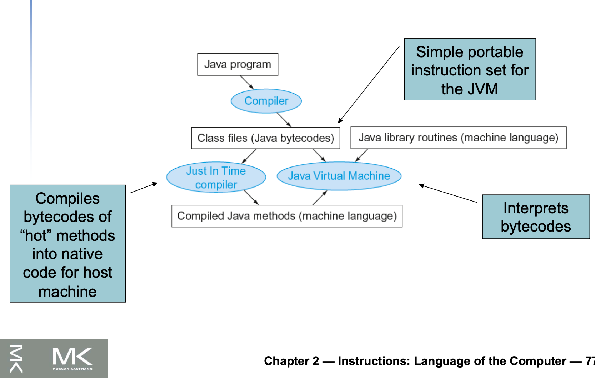

java VM 的好處就是，寫一份 java 的 code，在其他電腦上都可以跑，只要他有裝 java VM，而且跨作業系統。就像 docker 一樣。

微軟不希望這件事，所以推出官方的 java VM。但是他的 VM 跟別人不相容。所以 Java 去告微軟污染 Java 的生態系 xd 雖然有告成功，但微軟也成功污染了 Java 的生態系。

`just in time compiler` : 

## C sort example (bubble sort)

by swap

我們看到的 C code:

```c
void sort (long long int v[], size_t n) {
      size_t i, j;
      for (i = 0; i < n; i += 1) {
					for (j = i – 1;
								j >= 0 && v[j] > v[j + 1]; j -= 1) {
							swap(v,j); }
				} }

```

v  in x10,  n in x11, i in x19, j in x20

**outer loop** :

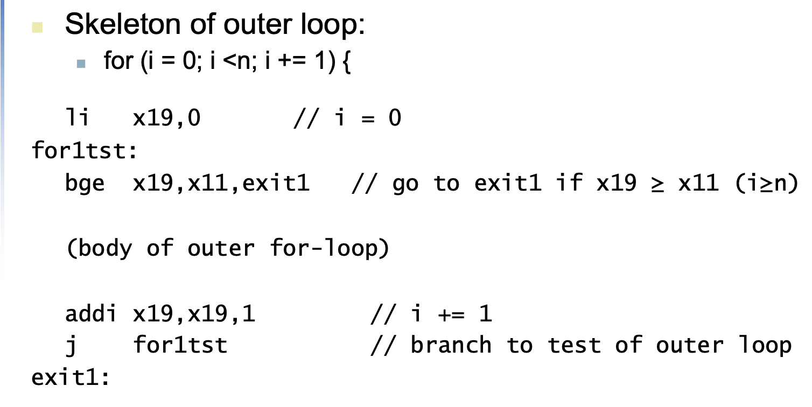

**inner loop**

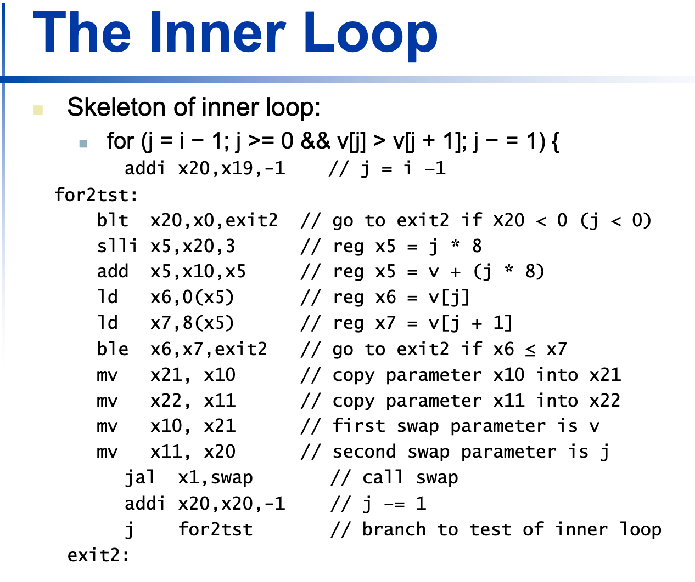

**preserving registers**

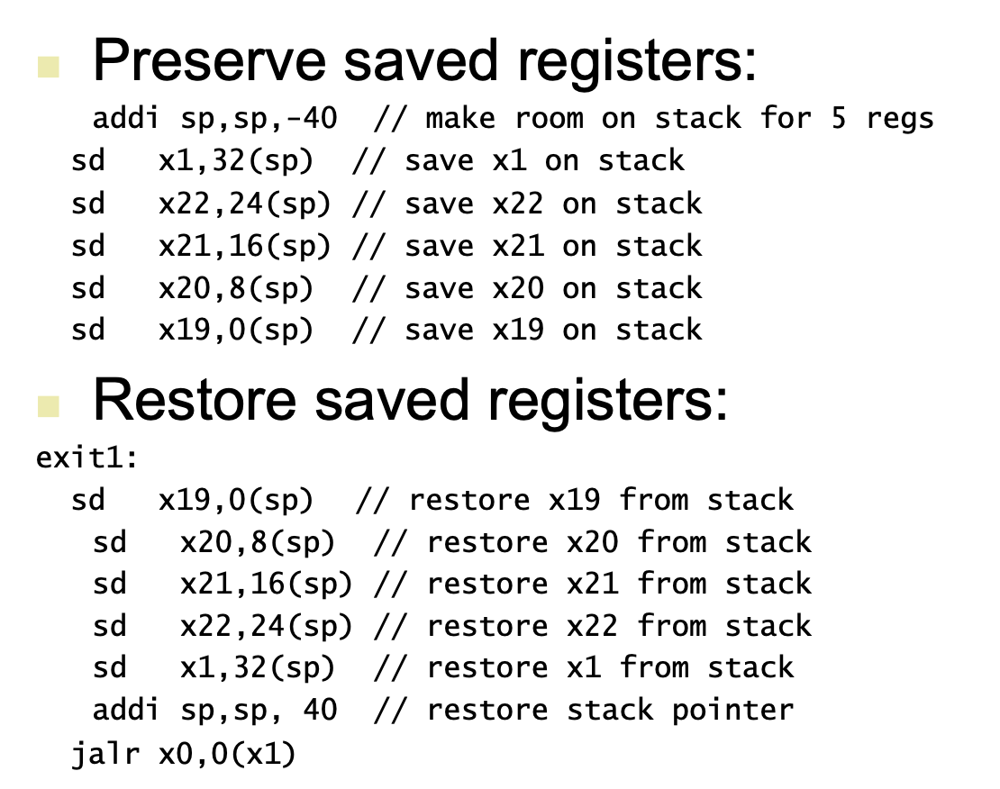

gcc 可以有優化：

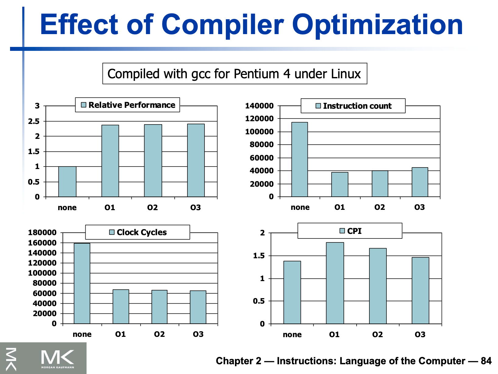

program 執行用的 instr. count 比較多， performance 不一定比較差。 instr. count 跟 CPI 綜合起來看。真正的效能應該是 instr. count  x CPI =  cycle 數 越少越好。


java 如果沒有 just in time (JIT) 優化，效果很差，比 C none 更差很多。

在 Quicksort 比較裡面， Java(JIT) 雖然有優化，但還是比 C none 差。

quicksort 的效果是 bubble sort 的上千倍，即使在最差的 Java也差幾百倍。 所以不管你用什麼語言，選演算法都很重要。

## C 語言為什麼會有 pointer ？

可以直接指向 mem  addr，避免取得 arr 時還要做複雜計算，例如要取得 起始位置，單位 size ，作乘法計算絕對位置等等。

### Example: Clearing an Array

假如是用 O3 optimizer，他可能會把左邊的翻譯換成右邊的翻譯，變得比較快。

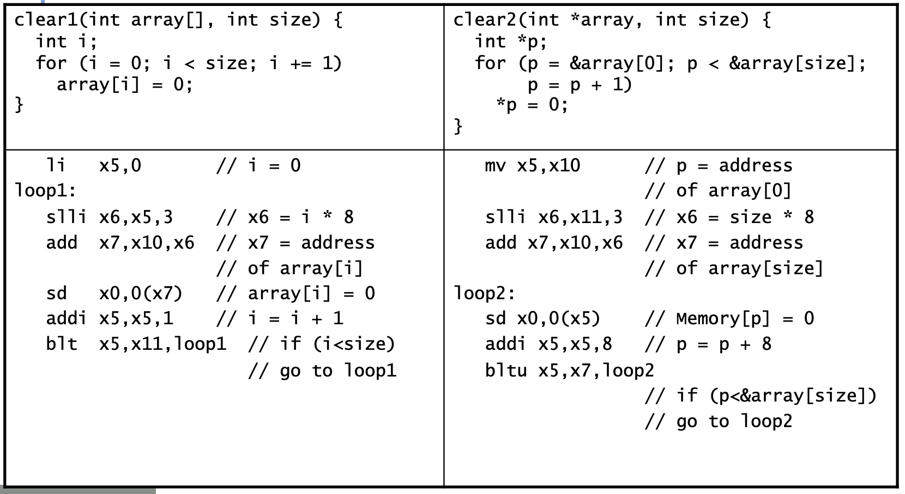

- loop 裡有五個指令

- loop 裡有3個指令

induction variable elimination 刪掉不必要的。

還是要用左邊的方式寫 code，比較易讀。反正 compiler 會幫忙。（但是也有可能他沒有幫忙xd)

這時候假如 compiler 沒有幫忙，而你有能力優化 compiler，就可能得到很大的 improve。

大哥 Intel

小弟 AMD 

小小弟 Cyrix

intel 自己生產晶片出現問題

AMD 設計晶片，但生產晶片交給台積電做

所以 AMD 有超越 intel 的趨勢

### x86 Instruction Encoding

長度都不同，解碼很麻煩

RV64I: 沒有乘法

32-bit variant: RV32I 

register比較少， 比較便宜

### Instruction Set Extensions

- M: integer multiply, divide, remainder （乘法）
A: atomic memory operationsn （多 processor）
- F: single-precision floating point （浮點數運算）
- D: double-precision floating point
- C: compressed instructions （更小的）

    16-bit encoding for frequently used
    instructions

- V: vector extension （向量運算）

### 釐清一些迷思

- 複雜的指令未必好
- instr. set 是可以追加的。只能多，不能少。新的 program 不能在舊電腦跑，是可以被接受的。

Design principles

比較小比較快

### 小知識

8 個 bit = 1 byte

16 bit = halfword

32 bit = word

64 bit = doubleword

long long int = 64 bits int

### Reference

[1] [riscv.org](http://riscv.org) 

[2] [https://blog.gtwang.org/programming/difference-between-big-endian-and-little-endian-implementation-in-c/](https://blog.gtwang.org/programming/difference-between-big-endian-and-little-endian-implementation-in-c/)

[3] [https://inst.eecs.berkeley.edu/~cs61c/resources/su18_lec/Lecture7.pdf](https://inst.eecs.berkeley.edu/~cs61c/resources/su18_lec/Lecture7.pdf)